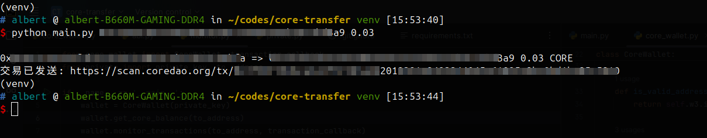
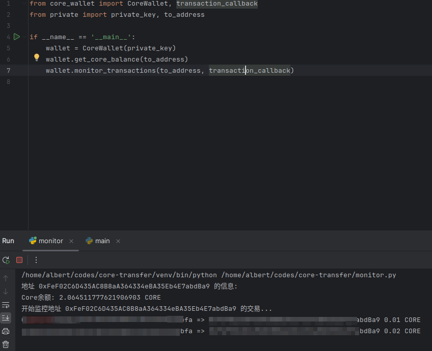

# 核心钱包转账工具

这是一个简单的Python脚本,用于执行核心钱包的转账和监控操作。

## 功能

- 向指定地址转账指定金额
- 监控指定地址的转账动态
- 使用命令行参数进行操作
- 错误处理和用户反馈

## 前置条件

- Python 3.6+
- 有效的私钥 (存储在 `private.py` 文件中)

## 安装

1. 克隆此仓库:
   ```
   git clone https://github.com/yourusername/core-wallet-transfer.git
   cd core-wallet-transfer
   ```

2. 安装依赖:
   ```
   python3 -m venv venv
   source venv/bin/activate
   pip install -r requirements.txt
   ```

3. 在 `private.py` 文件中设置你的私钥:
   ```python
   private_key = "your_private_key_here"
   ```

## 使用方法

使用以下命令运行脚本:

```
python main.py <钱包地址> <金额>
```

例如:
```
python main.py 0x1234567890123456789012345678901234567890 0.1
```

## 运行截图





## 错误处理

脚本会处理以下错误:

- 连接错误
- 输入错误
- 其他未预期的错误

## 安全注意事项

- 请确保妥善保管你的私钥,不要将其暴露给他人。
- 建议在进行大额转账前,先进行小额测试。

## 贡献

欢迎提交问题报告和拉取请求。对于重大更改,请先开issue讨论您想要更改的内容。

## 许可证

[MIT](https://choosealicense.com/licenses/mit/)